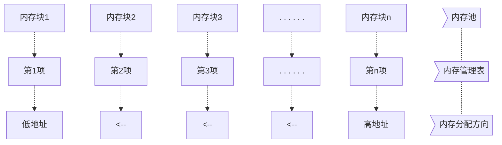

内存管理，是指软件运行时对计算机内存资源的分配和使用的技术。其最主要的目的是如何高效，快速的分配，并且在适当的时候释放和回收内存资源。 内存管理的实现方法有很多种他其实最终都是要实现 2 个函数： malloc 和 free； malloc 函数用于内存申请， free 函数用于内存释放。

从上图可以看出，分块式内存管理由内存池和内存管理表两部分组成。内存池被等分为 n块，对应的内存管理表，大小也为 n，内存管理表的每一个项对应内存池的一块内存。内存管理表的项值代表的意义为：当该项值为 0 的时候，代表对应的内存块未被占用，当该项值非零的时候，代表该项对应的内存块已经被占用，其数值则代表被连续占用的内存块数。比如某项值为 10，那么说明包括本项对应的内存块在内，总共分配了 10 个内存块给外部的某个指针。内寸分配方向如图所示，是从顶→底的分配方向。即首先从最末端开始找空内存。当内存管理刚初始化的时候，内存表全部清零，表示没有任何内存块被占用  

#### 分配原理
当指针 p 调用 malloc 申请内存的时候，先判断 p 要分配的内存块数（ m），然后从第 n 项开始，向下查找，直到找到 m 块连续的空内存块（即对应内存管理表项为 0），然后将这 m 个内存管理表项的值都设置为 m（标记被占用），最后，把最后的这个空内存块的地址返回指针 p，完成一次分配。注意，如果当内存不够的时候（找到最后也没找到连续的 m 块空闲内存），则返回 NULL 给 p，表示分配失败。
#### 释放原理
当 p 申请的内存用完，需要释放的时候，调用 free 函数实现。 free 函数先判断 p 指向的内存地址所对应的内存块，然后找到对应的内存管理表项目，得到 p 所占用的内存块数目 m（内存管理表项目的值就是所分配内存块的数目），将这 m 个内存管理表项目的值都清零，标记释放，完成一次内存释放。
